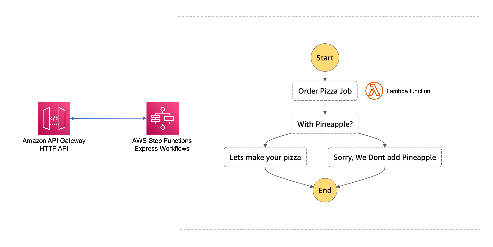

# The State Machine

This is an example CDK stack to deploy The State Machine stack described by Jeremy Daly here - https://www.jeremydaly.com/serverless-microservice-patterns-for-aws/#statemachine

You would use this pattern for simple or complex business logic in a synchronous or an asynchronous setup. Step Functions come with lots of built in robustness features that will reduce your code liability 




### Testing It Out

After deployment you should have an API Gateway HTTP API where on the base url you can send a POST request with a payload in the following format:

If is there any error creating or delivering the pizza should see the step function flow fail in the response payload

The response returned is the raw and full output from the step function so will look something like this:

```json
// A successful execution, note the status of SUCCEEDED
{
    "billingDetails": {
        "billedDurationInMilliseconds": 700,
        "billedMemoryUsedInMB": 64
    },
    "executionArn": "arn:aws:states:...",
    "input": "{}",
    "inputDetails": {
        "__type": "com.amazonaws.swf.base.model#CloudWatchEventsExecutionDataDetails",
        "included": true
    },
    "name": "b2640bca-3d4d-440d-b29f-a350fb2ef4ed",
    "output": "{\"createPizza\":{\"pizzaStatus\":\"Created\"},\"deliveryPizza\":{\"deliveryStatus\":\"Delivered\"}}",
    "outputDetails": {
        "__type": "com.amazonaws.swf.base.model#CloudWatchEventsExecutionDataDetails",
        "included": true
    },
    "startDate": 1.689821321505E9,
    "stateMachineArn": "arn:aws:states:us-east-1:505756683246:stateMachine:StateMachine2E01A3A5-SwJww3PTbeV1",
    "status": "SUCCEEDED",
    "stopDate": 1.689821322164E9,
    "traceHeader": "Root=1-64b8a089-637e8c54abdd40366b5f06fe;Sampled=1"
}

// a failed execution, notice status: FAILED and the cause/error properties
{
    "billingDetails": {
        "billedDurationInMilliseconds": 900,
        "billedMemoryUsedInMB": 64
    },
    "cause": "Not enough ingredients or far destination.",
    "error": "Failed to make or deliver the pizza.",
    "executionArn": "arn:aws:states: ...",
    "input": "{}",
    "inputDetails": {
        "__type": "com.amazonaws.swf.base.model#CloudWatchEventsExecutionDataDetails",
        "included": true
    },
    "name": "2b02d55f-58a4-494a-8b5c-4fcbe74c2f48",
    "outputDetails": {
        "__type": "com.amazonaws.swf.base.model#CloudWatchEventsExecutionDataDetails",
        "included": true
    },
    "startDate": 1.689822311521E9,
    "stateMachineArn": "arn:aws:states:us-east-1:505756683246:stateMachine:StateMachine2E01A3A5-SwJww3PTbeV1",
    "status": "FAILED",
    "stopDate": 1.689822312322E9,
    "traceHeader": "Root=1-64b8a467-033a96acb1a0fe5a7aa6d67d;Sampled=1"
}
```

## Common setup

Clone the repo and install the dependencies.

```bash
git clone git@github.com:ElmerMB13/cloud-pizza.git
cd cloud-pizza
```

```bash
npm install
```

## Useful commands

 * `npm run build`   compile typescript to js
 * `npm run watch`   watch for changes and compile
 * `npm run test`    perform the jest unit tests
 * `npm run deploy`      deploy this stack to your default AWS account/region
 * `cdk diff`        compare deployed stack with current state
 * `cdk synth`       emits the synthesized CloudFormation template
